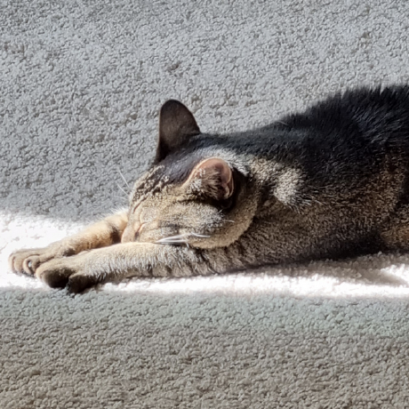

# Welcome

## Introduction

My name is Sunho. I'm a third year cs student from Muir College.

I've been really passionate about programming since when I was in elementary school. So, if you want to have a nerdy technical discussion or are stuck on some weird bug, feel free to hit me up! If you're curious about the works I've done, you can find them in: [suhno.io](https://sunho.io)

Besides work, I love playing chess and tetris. I've also started cooking most of my meal since last year and it has become a sort of hobby. The best food I can make is spicy stir-fried fork. I try to jog every single day, so you might find me running across campus at random hours. 



## Styled stuff for lab 1 requirements

**This** *is* ~~styeld~~ text.

This is quoted text.
`
I am text
`

This is quoted code.

```cpp
std::ranges::partition_point
```

[External link](https://www.youtube.com/watch?v=dQw4w9WgXcQ&ab_channel=RickAstley)

[Section link](#sect)

[Rel link](./README.md)

1. Ordered
2. List
3. Here

* Unordered
* List
* Here

- [ ] Todo
- [ ] List
- [ ] here

# sect

dest for sect link
